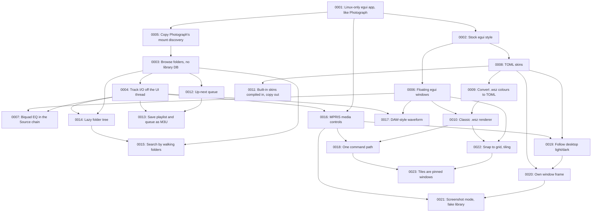

# Architecture Decision Records

This directory holds ADRs for UnAmp — short records of significant architecture decisions,
written at the time they're made, following Michael Nygard's format as popularized by Martin
Fowler: <https://martinfowler.com/bliki/ArchitectureDecisionRecord.html>.

## When to write one

Write an ADR when a decision is:

- Hard, or expensive, to reverse once other code depends on it.
- Not obvious from reading the code — a "why", not a "what".
- The kind of thing that'll get re-litigated later without a record ("didn't we already decide
  this?").

Small, reversible choices don't need one. Rule of thumb: if you'd want to explain the choice to a
new contributor in a paragraph beyond what the code itself shows, it's ADR-sized.

An ADR is a point-in-time record of *a decision as it was made*, including the options considered
and rejected. It does not get rewritten later — a decision that reverses or replaces an earlier one
gets its own new ADR that supersedes the old one, which stays in place with its status updated.

## Convention

- One file per decision: `NNNN-short-kebab-title.md`, numbered sequentially, zero-padded to 4
  digits. Numbers are never reused, even for a decision that gets reversed.
- Start from [`0000-template.md`](0000-template.md) — copy it, don't write from scratch.
- `Status` is one of: `Proposed`, `Accepted`, `Rejected`, `Deprecated`, or `Superseded by
  ADR-NNNN` (linked to the superseding record).
- Every new ADR gets a row in the index below.
- Keep records short — a paragraph or two per section is normal. An ADR documents a decision and
  its reasoning, not a design document.

For how skinning works from a user's point of view, see [../skinning.md](../skinning.md).

If you're working with Claude Code in this repo, `.claude/skills/adr/SKILL.md` automates the
mechanics of adding one.

## Index

| # | Title | Status |
|---|-------|--------|
| [0001](0001-linux-only-egui-native-app.md) | Build UnAmp as a Linux-only native egui/eframe app, following Photograph | Accepted |
| [0002](0002-stock-egui-style.md) | Use egui's stock style instead of a custom theme | Superseded by [ADR-0008](0008-toml-skins.md) |
| [0003](0003-browse-folders-no-library-database.md) | Browse folders directly instead of scanning into a library database | Proposed (no-search consequence superseded by [ADR-0015](0015-search-by-walking.md)) |
| [0004](0004-file-io-off-ui-thread.md) | Keep track I/O off the UI thread, with rodio/symphonia for playback and lofty for tags | Proposed |
| [0005](0005-reuse-photograph-mount-discovery.md) | Copy Photograph's mount discovery rather than sharing a crate | Proposed |
| [0006](0006-floating-egui-windows.md) | Use floating egui windows for the player, equalizer, playlist and media library | Accepted |
| [0007](0007-biquad-equalizer-in-source-chain.md) | Implement the equalizer as peaking biquads in a rodio `Source`, ahead of the visualizer tap | Proposed |
| [0008](0008-toml-skins.md) | Support skins as TOML files, keeping stock egui as the default | Accepted (bitmap exclusion superseded by [ADR-0010](0010-classic-wsz-renderer.md)) |
| [0009](0009-convert-winamp-wsz-colours.md) | Convert classic Winamp `.wsz` skins to TOML skins, colours only | Superseded by [ADR-0010](0010-classic-wsz-renderer.md) |
| [0010](0010-classic-wsz-renderer.md) | Render classic `.wsz` skins pixel-for-pixel in fixed-size windows | Accepted |
| [0011](0011-built-in-skins-compiled-in-copy-out.md) | Keep built-in skins compiled in, with a non-overwriting "copy to folder" for editing | Accepted |
| [0012](0012-up-next-queue.md) | Add an "up next" queue that plays before the playlist continues | Proposed |
| [0013](0013-save-session-as-m3u.md) | Save the playlist and queue as extended M3U files, after every change | Proposed |
| [0014](0014-lazy-folder-tree.md) | Show folders as a lazily loaded tree rooted at the current location | Proposed |
| [0015](0015-search-by-walking.md) | Search the current location by walking its folders, without an index | Proposed |
| [0016](0016-mpris-media-controls.md) | Expose playback over MPRIS with zbus, optional at runtime | Accepted |
| [0017](0017-daw-style-waveform.md) | Draw a DAW-style whole-track waveform by decoding the track a second time | Proposed |
| [0018](0018-one-command-path.md) | Route every front end through one command type and shared display rules | Accepted |
| [0019](0019-follow-desktop-color-scheme.md) | Follow the desktop's light/dark setting through the XDG portal | Accepted |
| [0020](0020-draw-own-window-frame.md) | Draw UnAmp's own window frame, following the skin | Accepted |
| [0021](0021-screenshot-mode.md) | Generate the docs screenshot from a fake library, with a screenshot mode in the app | Proposed |
| [0022](0022-snap-to-grid-and-tiling.md) | Snap floating windows to a grid, or tile them | Accepted (tile drawing superseded by [ADR-0023](0023-tile-with-pinned-windows.md)) |
| [0023](0023-tile-with-pinned-windows.md) | Tile with the real windows, pinned in place, instead of panels | Accepted |

## Decision Relationship

## Revisit Triggers

- A hung network mount freezes the UI while navigating into it — move directory listing to a
  worker ([ADR-0004](0004-file-io-off-ui-thread.md)).
- Opus (or other symphonia-unsupported formats) becomes a real need — revisit the decoder.
- Demand for artist/album browsing or tag search, or path search gets too slow on big shares —
  see [ADR-0003](0003-browse-folders-no-library-database.md) and [ADR-0015](0015-search-by-walking.md).
- Multi-monitor use or a mini player needs real OS windows — see [ADR-0006](0006-floating-egui-windows.md).
- Clipping from EQ boosts is audible in practice — add a limiter ([ADR-0007](0007-biquad-equalizer-in-source-chain.md)).
- Classic skins need windowshade mode, other scales or a resizable playlist — see the
  not-implemented list in [ADR-0010](0010-classic-wsz-renderer.md).
- Built-in skins start changing often enough that stale user copies cause confusion — see
  [ADR-0011](0011-built-in-skins-compiled-in-copy-out.md).
- The classic playlist needs to show the queue — see [ADR-0012](0012-up-next-queue.md).
- Very large playlists make save-on-every-change noticeable, or users want named playlists
  (load/save list) or resume-at-position — see [ADR-0013](0013-save-session-as-m3u.md).
- Clients need to browse the queue/playlist over D-Bus, or Raise doesn't focus on Wayland in
  practice — see [ADR-0016](0016-mpris-media-controls.md).
- Waveforms over a slow share lag or load the network noticeably, or recomputing after restarts
  matters — see [ADR-0017](0017-daw-style-waveform.md) (disk cache, zoom).
- winit/eframe start reporting the Linux system theme, or users want accent colours or high
  contrast followed — see [ADR-0019](0019-follow-desktop-color-scheme.md).
- The own frame misbehaves on a desktop (no compositor, tiling WMs, missing shadows bother
  people) — see [ADR-0020](0020-draw-own-window-frame.md); the system title bar is one click away.
- A third app wants mount discovery, or the two copies diverge — extract a crate ([ADR-0005](0005-reuse-photograph-mount-discovery.md)).
